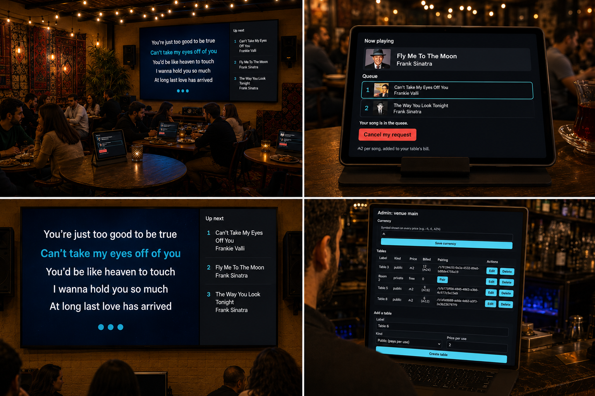
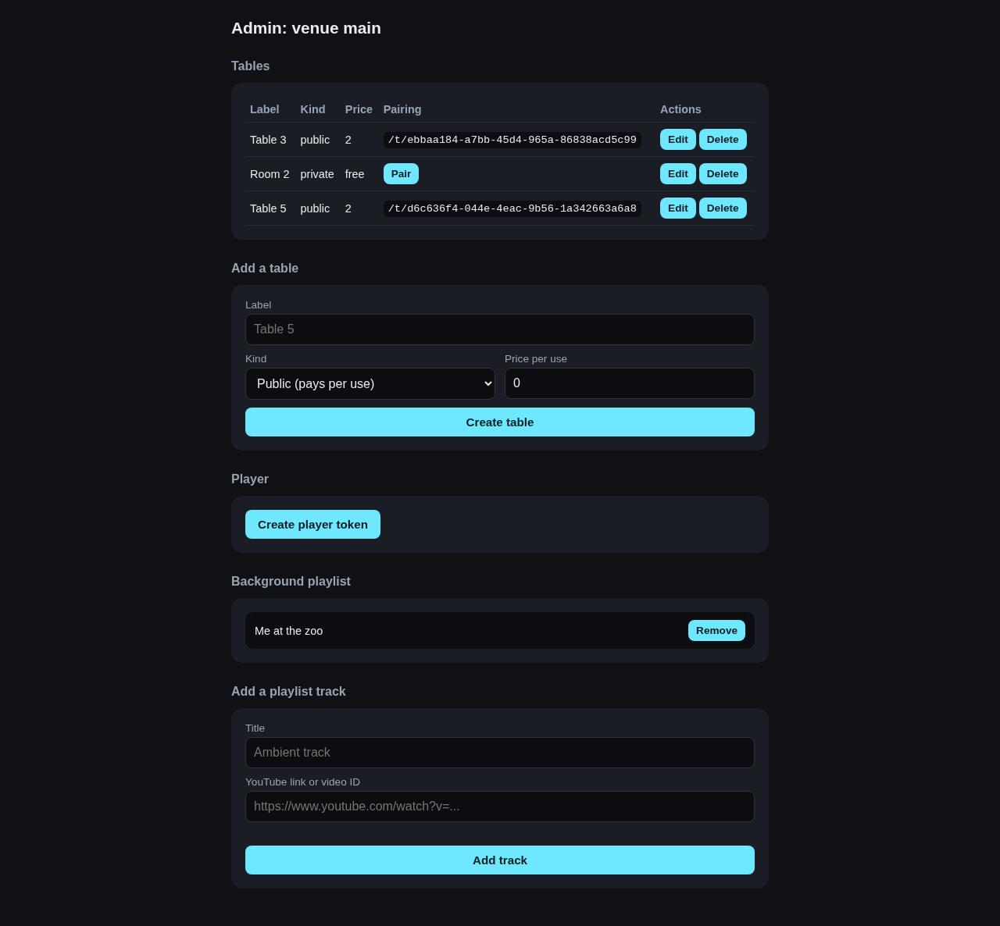
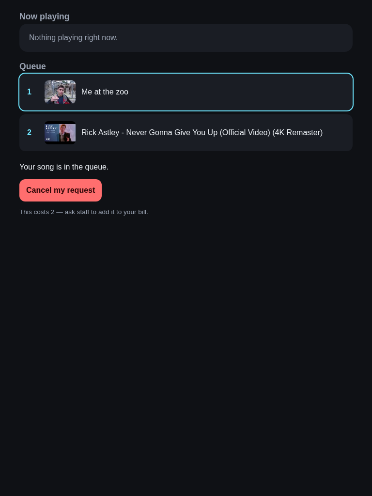

# karaoke-queue



A local-network song-request queue for restaurants and venues, built to
replace expensive per-song paid karaoke systems (the common model in
Azerbaijan: ~2 manat per song added to the bill) with a cheap or free,
centrally-run alternative. Guests at a table request songs from a tablet;
requests queue FIFO behind a continuous ambient background playlist; a
separate player page drives the venue's actual speakers.

## Running it

```
npm install
npm start
```

Two environment variables control where it runs:

- `PORT`: defaults to `8080`.
- `DB_PATH`: defaults to `./data/karaoke-queue.sqlite`. The database is
  a plain SQLite file with no migration system; delete it to start over.

On startup it prints every LAN-reachable address it found, e.g.:

```
karaoke-queue listening on port 8080
Database: ./data/karaoke-queue.sqlite

There is no venue-registration step. Pick any consistent
string as your venue id (e.g. "main") the first time you
visit an admin URL with it. Open one of these on a device
connected to the same network to set up tables:

  http://192.168.1.42:8080/admin/venues/main
```

There is no venue "registration" step: a venue is just whatever id
string you consistently use in your URLs (`main`, `downstairs`, anything).
The whole system is meant to run on one device on the venue's own
network (a laptop, or a phone acting as a WiFi hotspot) with tablets and
the output device connecting to that same network. No internet
connection is required for the system to function.

### Device combinations

"The server" above just means whichever single device runs `npm start`.
Everything else in this section is a fixed shape: N table tablets + 1
player device + 1 admin device (which can double as any of the others)
all joined to the same network as the server. Some real combinations:

- **Testing on one device.** Run the server on a laptop and open
  `/admin/...`, `/t/...`, and `/player/...` in separate browser tabs on
  that same laptop. Nothing about the software cares that they're the
  same machine, it's just the fastest way to try it out.
- **Real deployment, laptop as host.** A laptop runs the server and
  stays on all night; each table's tablet has its browser pointed
  permanently at its own `/t/:token` URL; a separate device (could be
  the same laptop, or another one plugged into the venue's speakers)
  stays open on `/player/:token`.
- **Phone acting as the hotspot AND the server.** If your phone can both
  create a WiFi hotspot and run this project (e.g. via Termux or
  similar), it's both roles at once: tablets and the player device
  join the phone's hotspot and use whatever LAN address it reports on
  startup.
- **Phone acting as ONLY the hotspot.** Some setups instead have the
  phone just providing the WiFi, while a laptop that also joined that
  same hotspot runs `npm start`. Tablets and the player device still
  join the phone's hotspot, but the address they connect to is the
  laptop's IP on that hotspot, not the phone's.
- **The player device can be anything on the network.** `/player/:token`
  is just a URL, it doesn't have to run on the same device as the
  server. Point whatever is actually wired or Bluetooth-connected to the
  venue's speakers (a TV, a mini PC, another tablet) at that URL.

**One real failure mode worth knowing about:** some routers and phone
hotspots enable "client isolation" (sometimes called "AP isolation" or
"guest network" mode) by default, which lets every device reach the
internet but blocks them from reaching each other. If tablets can join
the network but can't load the admin/table/player URLs, this is almost
always why. Look for that setting and turn it off.

## Setting up a venue



1. Start the server (above) and open the printed admin URL
   (`/admin/venues/<your-venue-id>`) from any device on the network.
2. **Set the currency symbol** at the top of the admin page (e.g. `$`,
   `₼`, `AZN`). It's prefixed on every price shown to guests and staff,
   so "2" reads as an actual amount instead of a bare number.
3. **Create tables**: a label, `public` (pays a per-use price) or
   `private` (always free, e.g. a room already charging a deposit). The
   admin Tables list also shows a running "Billed" count and total for
   each table, so staff can read it directly at checkout instead of
   asking the guest what they played.
4. **Pair each table**: click "Pair" next to a table, get its
   `/t/:token` URL. Point that specific tablet's browser (ideally kiosk
   mode, or just its bookmarked homepage) at that URL permanently. The
   token is what makes the anti-cheat guarantee work: refreshing the
   page, clearing cookies, or opening a private window all still load
   the same URL, so a table can never gain extra free requests that way,
   and a table's identity can't be spoofed by guessing another table's
   ID (the token is a long random value, not a number).
5. **Add background playlist tracks**: paste YouTube links/video IDs in
   the "Background playlist" section. This plays on a continuous loop
   whenever no table has an active request.
6. **Create a player token** and open the resulting `/player/:token` URL
   on whatever device is connected to the venue's speakers (Bluetooth or
   wired, that connection is the OS's job, outside this software).
   That page is the only thing that actually plays audio; leave it
   open and full-screen on that device.


## What guests see

Opening a paired `/t/:token` URL shows what's currently playing, the
live queue (so a table can see how many requests are ahead of them), and
a form to paste a YouTube link or video ID. A table can have one active
request at a time; once it's played (or cancelled), they can request
again. Everything updates live via WebSocket, no refreshing needed, and
refreshing doesn't help a table cheat the one-active-request rule either
way, since that's enforced server-side, not by anything the browser
remembers.



## Correcting an accidental play

A queued request that hasn't started playing yet can always be
cancelled for free, no questions asked. Once it starts playing, the
table's page offers "Skip this song" instead, for the case where the
wrong video started and the table wants it stopped immediately rather
than waiting it out:

- Skipping within the first 15 seconds of playback isn't billed. This
  covers the common accident: the wrong link got queued, it started
  playing, and the table wants a do-over before they've actually heard
  anything.
- Skipping after that still counts as a billable play, since the table
  got to actually hear the song.

Either way, the venue's player switches to the next item immediately;
the skipped video never plays out to the end.

## Known limitations (honest, not hidden)

- **No typed song search.** Finding a song means pasting its YouTube link
  or video ID, not typing a title and picking from search results. Real
  search needs the YouTube Data API, which requires a Google Cloud
  credential this project doesn't have and can't provision. A venue
  operator with their own API key could wire this in as a future
  enhancement. (Once a link is pasted, though, the real video title is
  fetched automatically via YouTube's official, keyless oEmbed
  endpoint, a different, credential-free API, so the queue shows the
  actual song title, not the raw link, falling back to the pasted text
  only if that lookup fails.)
- **No payment processing.** Pricing and the billed-count tally in admin
  are informational only, for staff to read at checkout. This software
  has no card/payment integration and doesn't charge anyone directly.
- **Public-performance licensing is not addressed.** Playing music (from
  any source, YouTube included) in a commercial venue typically requires
  a PRO license (ASCAP/BMI-style, or a regional equivalent) independent
  of how the audio is sourced. That's a real business/legal
  responsibility for the venue to handle. This software has no way to
  resolve it and doesn't attempt to.
- **Admin routes have no login.** They're presumed to be operated by
  whoever is setting up the system, not exposed to guests. There's no
  authentication in front of `/admin/*`.
- **Not every YouTube video allows embedding.** Some videos have
  embedding disabled by their uploader. The player detects this and
  automatically moves on to the next item rather than getting stuck.
- **No floor-plan editor.** Tables are a flat list (label, kind, price),
  not a visual layout you drag around.
